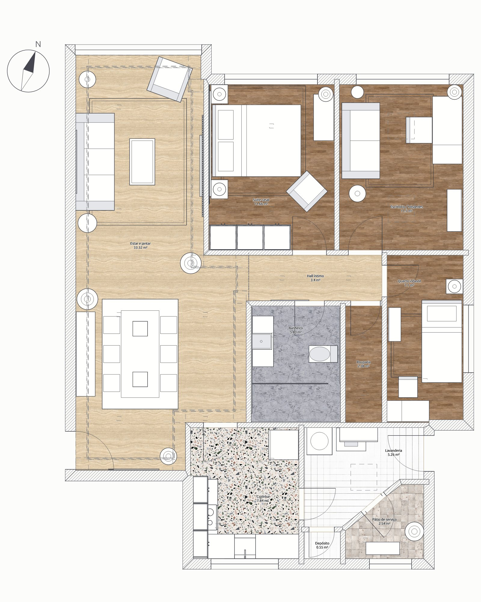
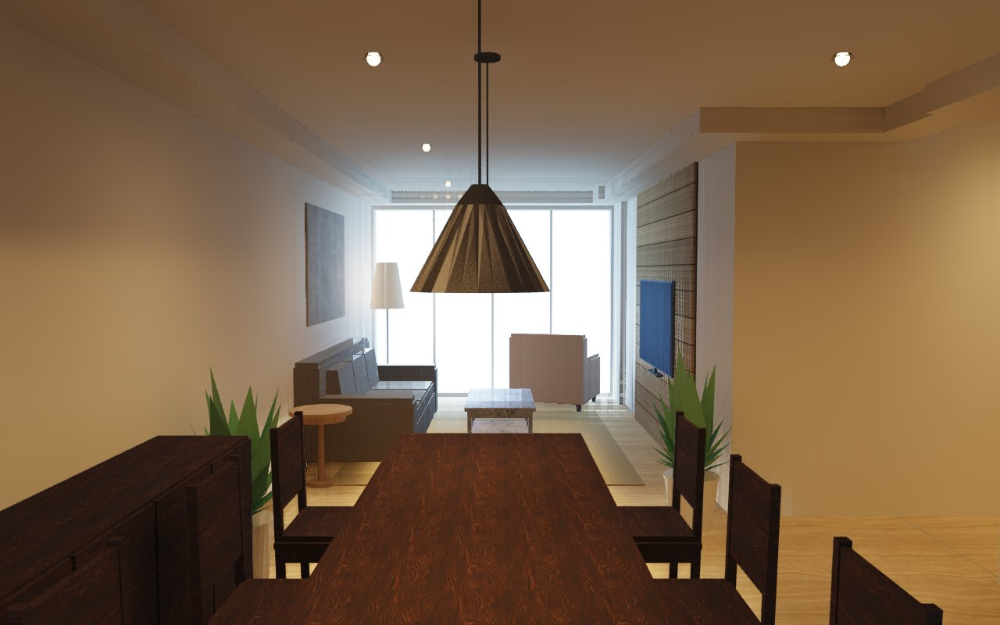
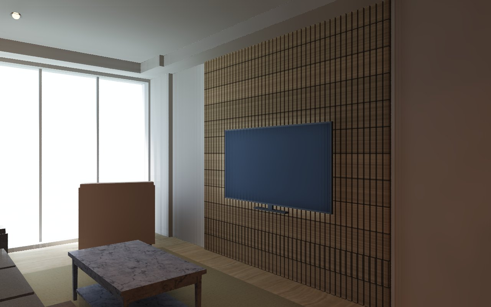
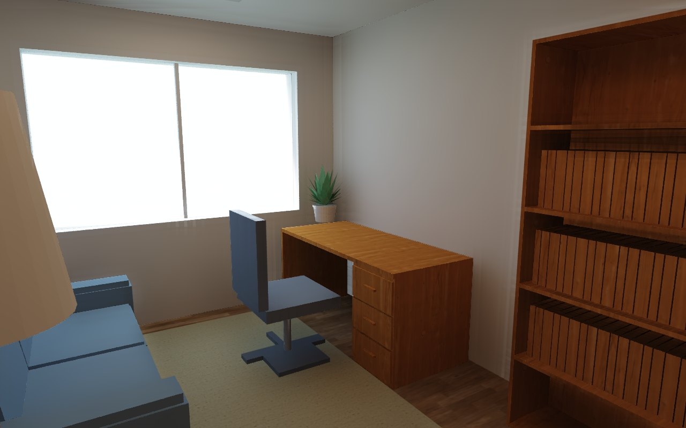

# 3D New Era AI

**English** · [Português (Brasil)](README.pt-BR.md) · **[Website](https://3dneweraai.com/?lang=en)**

[](https://github.com/leandrodaf/3d-new-era-ai/actions/workflows/ci.yml)
[](#license)
[](https://github.com/leandrodaf/3d-new-era-ai/releases/latest)

An open-source **home design, floor plan and interior design editor** written in Rust —
a Sweet Home 3D alternative for Windows, macOS and Linux — that is **AI-native from day
one**: the editor ships with a built-in
[Model Context Protocol](https://modelcontextprotocol.io) server, so an AI agent draws
walls, furnishes rooms, builds joinery, checks lighting and ergonomics against standards
and renders the photos alongside you, with every change showing up live on screen and one
Ctrl+Z away. Everything runs on your own machine: no account, no subscription, no cloud.
The interface speaks Portuguese, English, Spanish and French.


## Download

**Windows** — open PowerShell and paste:

```powershell
irm https://raw.githubusercontent.com/leandrodaf/3d-new-era-ai/main/scripts/install-windows.ps1 | iex
```

**macOS** (Apple Silicon and Intel) — open Terminal and paste:

```sh
curl -fsSL https://raw.githubusercontent.com/leandrodaf/3d-new-era-ai/main/scripts/install-macos.sh | bash
```

That's it: the app shows up in the Start menu / Launchpad, no administrator password,
and the same command updates it. Prefer a plain download?

| [Windows (64-bit)](https://github.com/leandrodaf/3d-new-era-ai/releases/latest/download/newera-windows-x64.zip) | [Mac Apple Silicon](https://github.com/leandrodaf/3d-new-era-ai/releases/latest/download/newera-macos-apple-silicon.zip) | [Mac Intel](https://github.com/leandrodaf/3d-new-era-ai/releases/latest/download/newera-macos-intel.zip) | [Linux (x64)](https://github.com/leandrodaf/3d-new-era-ai/releases/latest/download/newera-linux-x64.tar.gz) |
|:---:|:---:|:---:|:---:|

<details>
<summary>First launch of a plain download</summary>

The builds aren't signed with a paid Apple or Microsoft certificate, so the system asks
once:

- **Windows:** unzip, open `newera-gui.exe`; if SmartScreen appears, click
  *More info* → *Run anyway*.
- **macOS:** unzip and move *3D New Era AI* to Applications. Right-click it → *Open* →
  *Open*. On macOS 15 and later, open it once, then go to *System Settings* →
  *Privacy & Security* → *Open Anyway*. Or run
  `xattr -dr com.apple.quarantine "/Applications/3D New Era AI.app"`.
- **Linux:** `tar xzf newera-linux-x64.tar.gz && ./newera/newera`. Run
  `./newera/install-desktop.sh` to add it to the menu with its icon and to give
  `.newera` files their own icon and double click (`--uninstall` undoes it).

The one-line installers above skip these prompts.
</details>

Next: **[connect your AI](#connect-your-ai)** — Claude, Codex, Gemini, Cursor, VS Code,
DeepSeek and others.

## Showcase

A real 105 m² apartment, traced from an openly licensed floor plan and furnished, lit
and photographed by an AI agent through MCP alone — walls from the scan, doors that
swing the right way, slatted TV wall, L kitchen and wardrobe from `cabinet_run`,
downlights sized by photometry against NBR ISO/CIE 8995-1, path-traced photos.
Every image below came out of the editor itself.
**[See how it was built →](docs/SHOWCASE.md)**

| Floor plan with real finishes | Aerial cutaway |
|---|---|
|  |  |

| Daylight | At dusk, lamps on |
|---|---|
|  |  |
|  |  |
|  |  |

| Joinery and rooms | |
|---|---|
|  |  |
|  |  |

## Why

- **Fast and light.** Native Rust, GPU rendering through `wgpu` (Vulkan, Metal, DirectX 12).
- **One command, everything running.** The window, the REST API and the MCP server
  start together and share the same document.
- **AI as a first-class client.** People and agents go through the same undoable
  commands. An agent's edit is one Ctrl+Z away.
- **Cheap for agents.** Short ids (`w12`), `[x, y]` points, compact reads and
  one-line write replies keep token usage low.
- **Real-world scale.** Everything is in centimeters, like architectural drawings.
- **Try alternatives safely.** Duplicate the plan into a new tab, change it, and compare
  versions side by side.
- **Furniture that is always true to size.** The catalog is generated by code, so a
  158 × 208 cm bed is exactly that in the plan, in 3D and in collision checks.

## What it does

- **Plans from anything.** Draw walls, arcs and sloping walls, or drop in a scanned plan
  at real scale and let `trace_background` find the walls. Open Sweet Home 3D (`.sh3d`)
  projects as they are.
- **Joinery a workshop can build.** Parametric cabinets, wardrobes, slatted panels,
  countertops with exact sink and cooktop cutouts, plaster coves with LED and modular
  sofas. `cabinet_run` fills a wall with even modules around doors, windows and corners;
  `cut_list` exports the boards as CSV or DXF/SVG sheets.
- **Checked against the people who live there.** An ergonomics review (circulation,
  beds and bathrooms per person, kitchen triangle, wheelchair turning space) and lux per
  room by photometry, both against Brazilian standards (NBR 9050, NBR 15575-1,
  NBR ISO/CIE 8995-1), each finding with the fix to apply.
- **Pictures that sell the project.** Rendered floor plans with real finishes, elevations
  and sections, aerial cutaways, path-traced photos with the sun from the compass and
  the lamps you placed, and videos along a camera path. They render without a graphics
  card, so a headless server can take them too.
- **Roofs and structure.** Pitched roofs with skylights, walls and glass that follow the
  roof above, beams, storeys, pools and decks.
- **Anywhere.** Desktop editor, the full editor in the browser (WebGPU or WebGL), a
  lightweight WebAssembly viewer, plugins in any language over the HTTP API and several
  people on the same project with named cursors.

## Build from source

The installers from [Download](#download) work for your user only: they put the app in
`~/Applications` or `%LOCALAPPDATA%\Programs`, add `newera` to your `PATH`, register the
MCP server in Claude Code and Codex if you have them, and delete their temporary files. Uninstall
with `install-macos.sh --uninstall` or from *Settings → Apps* on Windows. On a Mac with no
build for it, or with `NEWERA_REF=<branch>`, the installer compiles from source instead.

To work on the code you need Rust 1.95+ ([rustup](https://rustup.rs)). On Linux you also
need `libxkbcommon-dev libwayland-dev libx11-dev libxcursor-dev libxrandr-dev libxi-dev`.

```sh
git clone https://github.com/leandrodaf/3d-new-era-ai
cd 3d-new-era-ai
make run          # editor + HTTP + MCP, with a sample house
make release      # optimized binary in target/release/newera
```

Run `make` to see every development command. `make web-serve` builds the browser editor
and viewer and serves them at `http://127.0.0.1:8790`.

## Connect your AI

Open the editor (or run `newera serve` for no window). It serves MCP at
**`http://127.0.0.1:7878/mcp`** — point your AI there and it edits the plan you see, live.

**In a browser, with nothing installed.** Open <https://3dneweraai.com/app/>,
switch the MCP on in the **AI** panel (or Ctrl+Shift+M) and the tab gets an
address your AI can reach — paste it where you would paste the local one. A
small relay stands between the two because a tab cannot listen on a port; it
passes messages and stores nothing, the project never leaves the tab, and the
address stops answering the moment you switch it off or close the tab. Treat
that address like a password: whoever has it can edit the project that is
open. `render_photo` and `video` are not offered there — they run for minutes
on a CPU and would freeze the window; that is what the app is for.

The relay is in this repository (`newera-relay`) and is a service like any
other: `cargo run -p newera-relay` puts one on `127.0.0.1:7979`, and
`/app/?relay=http://127.0.0.1:7979` points the editor at it — which is how to
run this whole path on your own machine, or on your own server. Whatever it is
pointed at, nothing of the project is stored there: the calls pass through and
the drawing stays in the tab.

The window does this part for you: the **AI** menu (or the MCP chip in the
status bar) opens a panel with the address, the snippet for whichever client
you use, and — when that client has a command line and it is installed — a
button that registers it from there, no terminal. The same panel is how you
know it worked: it names the client that connected and lists the tools it is
calling, as it calls them. The status bar says it too, from across the room.

**Claude Code**

```sh
claude mcp add --transport http newera http://127.0.0.1:7878/mcp
```

Inside a clone of this repository it's already set up by `.mcp.json` (approve `newera` once).

**Codex CLI**

```sh
codex mcp add newera --url http://127.0.0.1:7878/mcp
```

**Gemini CLI**

```sh
gemini mcp add --transport http newera http://127.0.0.1:7878/mcp
```

**VS Code (Copilot agent mode)**

```sh
code --add-mcp '{"name":"newera","type":"http","url":"http://127.0.0.1:7878/mcp"}'
```

**Cursor** — `~/.cursor/mcp.json`

```json
{ "mcpServers": { "newera": { "url": "http://127.0.0.1:7878/mcp" } } }
```

**Windsurf** — `~/.codeium/windsurf/mcp_config.json`

```json
{ "mcpServers": { "newera": { "serverUrl": "http://127.0.0.1:7878/mcp" } } }
```

**Claude Desktop** — *Settings → Developer → Edit Config* (needs [Node.js](https://nodejs.org)
for the `mcp-remote` bridge)

```json
{ "mcpServers": { "newera": { "command": "npx", "args": ["-y", "mcp-remote", "http://127.0.0.1:7878/mcp"] } } }
```

**DeepSeek, Qwen, Llama and other models** — the model doesn't matter, the app you chat in
does. Use one that speaks MCP and add the URL above: [Cline](https://cline.bot) or
[Roo Code](https://roocode.com) in VS Code, [Cherry Studio](https://cherry-ai.com),
[LM Studio](https://lmstudio.ai) or [opencode](https://opencode.ai) (`opencode.json`):

```json
{ "mcp": { "newera": { "type": "remote", "url": "http://127.0.0.1:7878/mcp" } } }
```

**Any other client** — streamable HTTP at `http://127.0.0.1:7878/mcp`, or, for clients that only start a
process, stdio with `newera mcp`:

```json
{ "mcpServers": { "newera": { "command": "newera", "args": ["mcp"] } } }
```

With the editor open, stdio edits the plan in that window, just like the URL; with no
window (or `newera mcp --standalone`) the agent works on its own project in the
background. Then just ask, for example: *"Draw a 4 × 5 m
bedroom with a door and a window, furnish it and render a photo."*

### Tools

Reads and changes are separate tools: a read never changes the plan, so an AI client can run it
without asking, and asks before each change.

| Tool | What it does |
|------|--------------|
| `get_home` | Compact state (`detail=summary` for counts, bounds and room areas) |
| `create` | Walls (polylines, arcs, sloping `hs`), rooms (polygon or detected from walls, dividers), dimensions, labels, roofs with skylights and solids from outlines or profiles — one atomic call |
| `update` / `move` / `delete` | Edit any element by id |
| `arrange` | Copies in a row, rotate, mirror, group/ungroup, drawing order |
| `split_wall` / `merge_walls` | Split a wall in two, or join walls on one line into a single wall |
| `checkpoint` / `checkpoints` | Name where the plan is and come back to it, keeping every id |
| `set_home` | Project name, compass (north), the city whose code applies and who lives there |
| `set_background` | Scanned plan at real scale: calibrations, X/Y scale, rotation |
| `trace_background` / `trace_walls` | Find walls in the scanned plan, and create them |
| `joinery` | Parametric cabinets, slatted panels, countertops with cutouts, plaster coves, shadow gaps and modular sofas; workshop rules come back as notes and never refuse to draw |
| `cabinet_run` | Fill a wall with cabinets sized for it: even modules around corners, doors, windows, fridge and stove, drawer unit by the stove, blind corners in L kitchens |
| `fit_roof` | Walls, glass and panels take the shape of the roof above (A-frame gables, sheds) and keep following it |
| `embed` | Embed a sink bowl or cooktop in a countertop (exact cutout) or an oven/microwave in a cabinet niche; the item moves with its host |
| `lighting` | Lux per room by photometry (fixtures in lm/W, color temperature, spots, LED panels and strips) against NBR ISO/CIE 8995-1; `fill_lighting` places the fixtures a room needs |
| `ergonomics` | Review for the people living there: circulation, beds/seats/bathrooms per person, kitchen, doors, ceiling heights, windows, wheelchair use (NBR 9050, NBR 15575-1) |
| `cut_list` / `export_cut_list` | Cut list of the joinery builds (boards merged, edge banding, hardware), written as CSV or DXF/SVG sheets |
| `render_plan` | PNG of the plan, exactly as the user sees it (`bg` overlays the scan) |
| `show_plan` | The plan inside the chat, as an interactive viewer (pan, zoom, 3D) in clients that speak MCP Apps |
| `render_3d` | Software 3D: aerial, visitor, stored cameras, elevations and sections |
| `render_photo` | Path-traced photo with sun and lamps |
| `export_plan` | PDF, SVG, PNG plan; GLB/OBJ model |
| `save_home` / `open_home` / `new_home` | Projects (`.newera`) and Sweet Home 3D import (`.sh3d`) |
| `catalog` | Search the parametric furniture catalog (rows `[id,name,w,d,h]`) |
| `place` | Furniture, doors and windows (snap into walls, swing side), beams, finishes, glass, batch defaults |
| `check_layout` | Overlaps, pieces in walls, blocked doors, cabinets turned against their own fronts, doors in no wall, pieces outside rooms, areas vs. reference |
| `accept` | Mark findings of any review as looked at, with the reason; `prune` drops the ones whose problem is gone |
| `variants` / `edit_variants` | Plan versions as tabs: list with stats; duplicate, switch, rename, delete |
| `levels` / `cameras` / `video` | Storeys, points of view, camera path videos — each changed through its `edit_*` |
| `electrical` / `plumbing` | NBR 5410 / NBR 5626 / NBR 8160 projects over the plan: checks, circuits and panel, Wi-Fi coverage; `edit_electrical` / `edit_plumbing` assign circuits and lay the runs |
| `materials` / `disciplines` / `annotations` | Finishes, which projects and layers are shown, dimension chains and reference schedules; `stale` finds notes whose numbers stopped matching the drawing, and `edit_annotations anchor` ties dimensions to what they mark so they measure themselves again |
| `measure` | Tape over the plan: free floor around a piece, the gap between two, what a straight probe runs into — and `fit`, how big a piece can grow before a clearance breaks |
| `plugins` / `run_plugin` / `sessions` | External plugins and the people working on the project |
| `undo` / `redo` / `checkpoint` | Shared history with the user; named points to come back to, ids intact |

## Modes

```sh
newera [FILE]           # desktop editor with embedded HTTP + MCP server
newera --demo           # start with a sample house
newera gui --no-server  # editor only
newera serve [FILE]     # headless HTTP + MCP server
newera mcp              # MCP over stdio (the open window, if there is one)
```

Options: `--addr 127.0.0.1:7878` (or `NEWERA_ADDR`), `--token` (or `NEWERA_TOKEN`, required
to listen beyond loopback), log filter via `NEWERA_LOG`, `NEWERA_RENDER_THREADS` for
photo renders (half the cores by default). The server binds to loopback by default and
validates the `Host` header. On Windows, `newera-gui.exe` opens the editor without a
console window.

### In the browser

The same editor compiles to WebAssembly and runs in a page, with no server behind it:
the project lives in the tab and is saved to a file with *Save*.

```sh
make web-editor   # builds web/editor/pkg with wasm-bindgen
make web-serve    # viewer on / and editor on /editor/ at 127.0.0.1:8790
```

The published site is built by `scripts/site-build.sh` — landing page at the root, editor
at `/app/`, viewer at `/viewer/` — and deployed to Cloudflare Pages by
`.github/workflows/publish.yml` on every push to `main` that touches it.

**Browsers.** Supported: **Chrome and Edge**, and Safari 26, which has WebGPU. Where
WebGPU is missing — Firefox today — the editor falls back to WebGL 2 and still draws
everything, plan and 3D; it works, but it is not a browser we guarantee, and the page says
so. A browser with neither gets a message pointing at the download instead of a blank
page.

To put it on a host of your own, serve the `web/` folder as static files. Two things
matter: `.wasm` must be served as `application/wasm`, and it must be compressed — the
editor is about 15 MB raw and roughly a quarter of that gzipped, so
`gzip_types application/wasm;` (nginx) or the equivalent is the difference between a
three-second load and a thirty-second one. Nothing else is needed: no COOP/COEP headers,
no backend, no database. The MCP server is part of the desktop program and is not built
into the page — a browser tab is for drawing and showing, and the agent works against the
app running on someone's machine.

`scripts/web-editor-e2e.mjs` is the check CI runs on it: headless Chrome, draws a wall
with the mouse, opens the viewer, and fails on any error the page logs.

## Project layout

```
crates/
  newera-core        domain model, commands, undo/redo, geometry, lighting — no UI, no I/O
  newera-joinery     parametric joinery and interiors: parts, workshop rules, cut lists, cabinet runs
  newera-ergonomics  habitability review: clearances, occupancy, kitchens, accessibility
  newera-catalog     parametric furniture and fixtures at exact sizes; OBJ/glTF import
  newera-draw        plan scene shared by the editor, PNG renders and SVG/PDF export
  newera-render      3D meshes, software renderer, path-traced photos, videos
  newera-sh3d        Sweet Home 3D (.sh3d) import
  newera-plugins     external programs that edit the home over the HTTP API
  newera-mcp         MCP tools (rmcp), stdio and Streamable HTTP
  newera-server      axum: REST API + MCP endpoint, sessions
  newera-app         desktop editor: egui + wgpu
  newera-editor-web  the editor in the browser (WebGPU or WebGL)
  newera-web         WebAssembly viewer: plan SVG and 3D views
  newera             the binary that wires everything together
```

See [docs/ARCHITECTURE.md](docs/ARCHITECTURE.md) for how it fits together,
[docs/SHOWCASE.md](docs/SHOWCASE.md) for a full project built by an agent,
[docs/NORMAS.md](docs/NORMAS.md) for the standards the review leans on — with
edition, tier and link, in Portuguese because the sources are Brazilian — and
[docs/ROADMAP.md](docs/ROADMAP.md) for what comes next.

## Telemetry

Released builds send crash reports to the developers through Sentry, and the
notes agents leave with the MCP `feedback` tool — what a tool could have done
better, with the call, the reply and what must not get worse. It is **on by
default** and off with one click in **Help → Send error reports**, or
`newera telemetry off`; `NEWERA_TELEMETRY=0` turns it off for a single run.
Nothing of the project is sent, nor the IP address or the machine's name, and
the MCP token is removed from every report. Notes are always kept locally in
the config folder (`notes.jsonl`), sent or not. A build from source reports
only when built with `NEWERA_SENTRY_DSN`.

Released builds also count one thing in Google Analytics: that the app was
opened, with its version, the operating system and the mode (`gui`, `serve`,
`mcp`). It rides the same switch, carries an id drawn at random for the
installation — not a person — and needs `NEWERA_GA_API_SECRET` at build time,
so a build from source counts nothing. The site counts page views in the same
property; the project itself never leaves your machine either way.

## Contributing

Contributions are welcome — see [CONTRIBUTING.md](CONTRIBUTING.md). `make check`
runs the same checks as CI.

## License

Licensed under either of [Apache License 2.0](LICENSE-APACHE) or
[MIT license](LICENSE-MIT), at your option.
