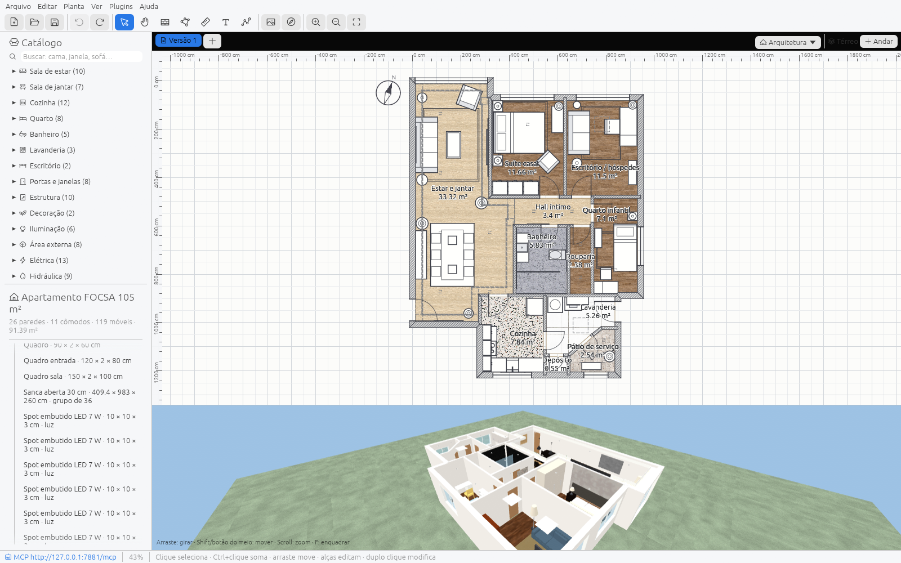
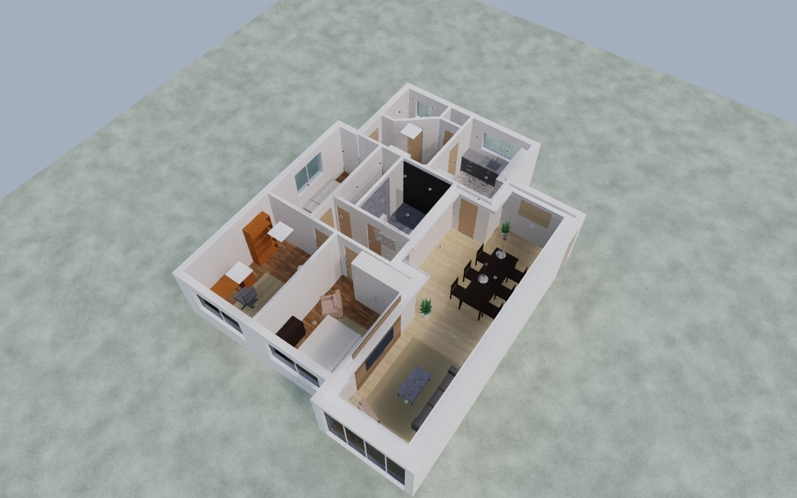
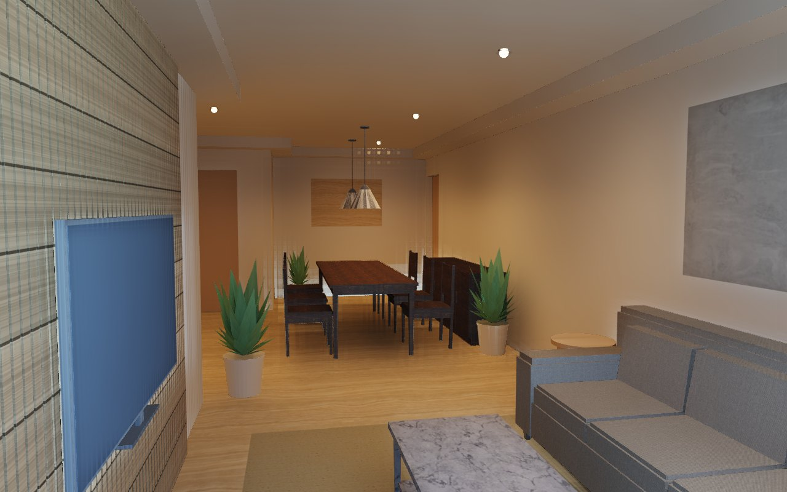
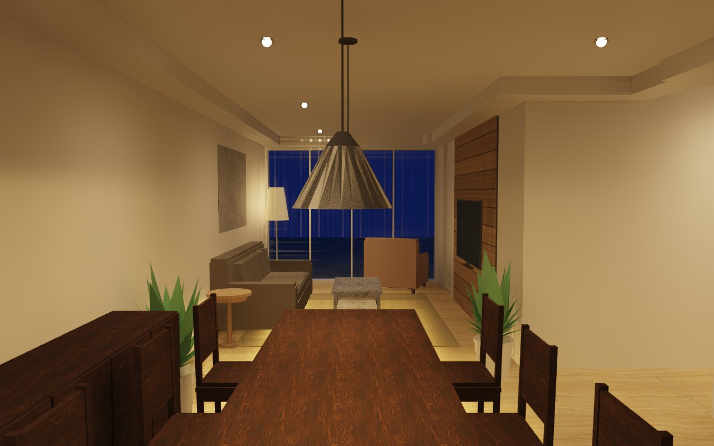
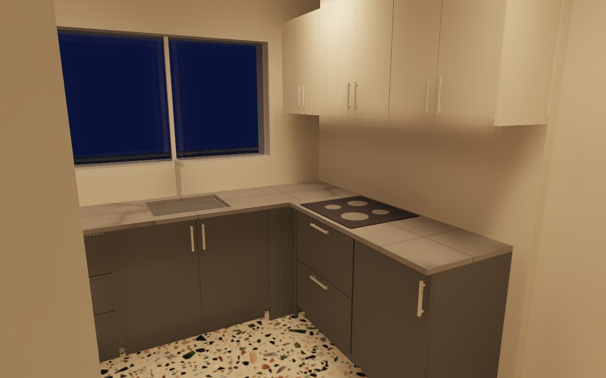
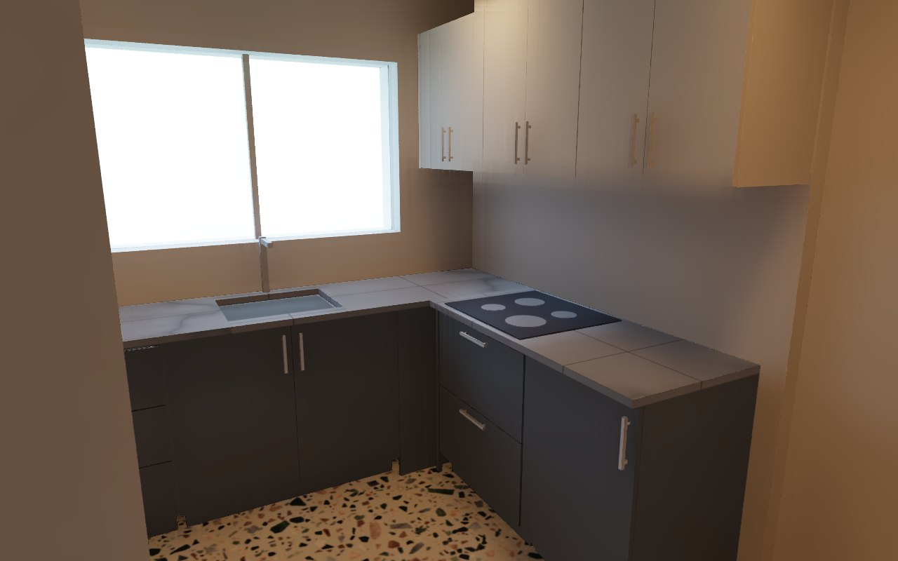
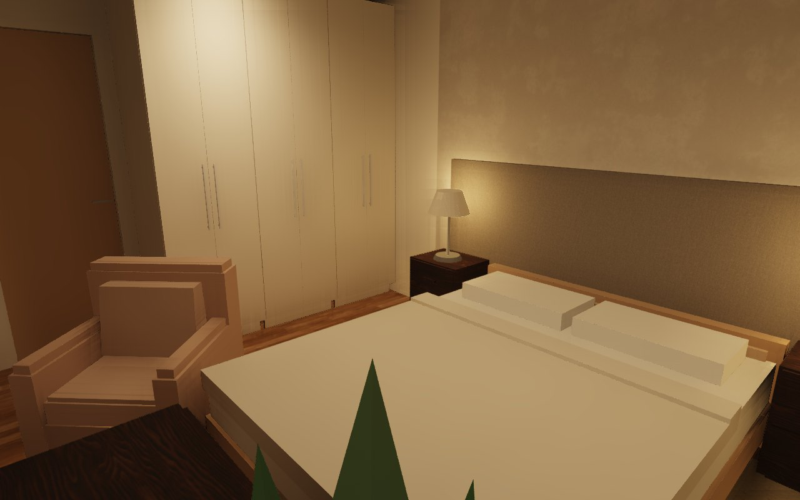
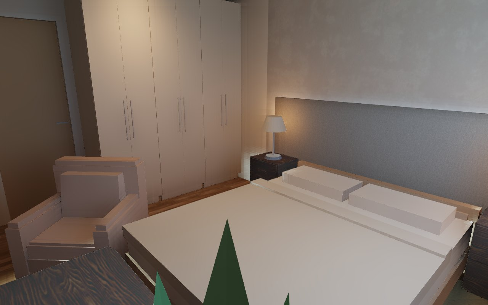
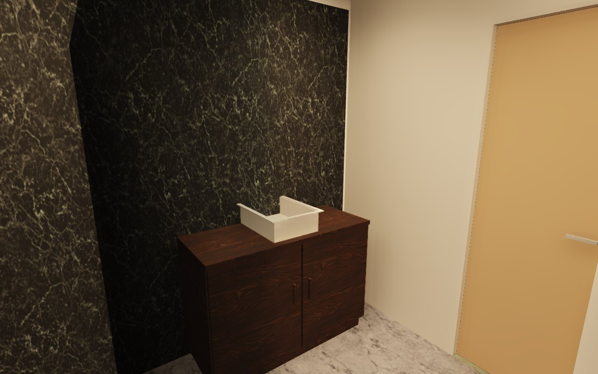

# 3D New Era AI

**English** · [Português (Brasil)](README.pt-BR.md) · **[Website](https://3dneweraai.com/?lang=en)** · **[Try it in the browser](https://3dneweraai.com/app/)**

[](https://github.com/leandrodaf/3d-new-era-ai/actions/workflows/ci.yml)
[](https://github.com/leandrodaf/3d-new-era-ai/releases/latest)
[](#license)

An open-source **home design, floor plan and interior design editor** written in Rust,
built so that **your AI can design with you**. It ships with a
[Model Context Protocol](https://modelcontextprotocol.io) server: Claude, ChatGPT, Codex,
Gemini, Cursor or any other MCP client draws the walls, furnishes the rooms, builds the
joinery, checks lighting and ergonomics against real standards and renders the photos,
while every change shows up live on screen and is one Ctrl+Z away.

A Sweet Home 3D alternative for Windows, macOS, Linux and the browser, in English,
Portuguese, Spanish and French.



## Three ways to use it

| | What you get | Account |
|---|---|---|
| **[Desktop app](#install)** | The full editor on your machine, with a local MCP server at `127.0.0.1:7878`. Nothing leaves your computer. | none |
| **[Browser editor](https://3dneweraai.com/app/)** | The same editor in a tab (WebGPU or WebGL). Switch on its MCP and your AI edits the tab's project. | none |
| **[Hosted connector](https://3dneweraai.com/connector/)** | Add `https://mcp.3dneweraai.com/mcp` to Claude or ChatGPT and design from the chat, with projects kept in your account. | email sign-in |

The desktop app and the browser editor are free, open source and need no account. The
hosted connector is free within a quota; see [pricing](https://3dneweraai.com/pricing/).

## Install

**Windows** — in PowerShell:

```powershell
irm https://raw.githubusercontent.com/leandrodaf/3d-new-era-ai/main/scripts/install-windows.ps1 | iex
```

**macOS** (Apple Silicon and Intel) — in Terminal:

```sh
curl -fsSL https://raw.githubusercontent.com/leandrodaf/3d-new-era-ai/main/scripts/install-macos.sh | bash
```

or with Homebrew: `brew install --cask leandrodaf/tap/3d-new-era-ai`.

The installers work for your user only, with no administrator password: the app appears
in the Start menu or Launchpad, `newera` goes on your `PATH`, the MCP server is registered
in Claude Code and Codex if you have them, and running the same command again updates it.
Uninstall with `install-macos.sh --uninstall`, or from *Settings → Apps* on Windows.

Prefer a plain download?

| [Windows (x64)](https://github.com/leandrodaf/3d-new-era-ai/releases/latest/download/newera-windows-x64.zip) | [macOS Apple Silicon](https://github.com/leandrodaf/3d-new-era-ai/releases/latest/download/newera-macos-apple-silicon.zip) | [macOS Intel](https://github.com/leandrodaf/3d-new-era-ai/releases/latest/download/newera-macos-intel.zip) | [Linux (x64)](https://github.com/leandrodaf/3d-new-era-ai/releases/latest/download/newera-linux-x64.tar.gz) |
|:---:|:---:|:---:|:---:|

<details>
<summary>First launch of a plain download</summary>

The builds are not signed with a paid Apple or Microsoft certificate, so the system asks
once:

- **Windows:** unzip and open `newera-gui.exe`; if SmartScreen appears, click
  *More info* → *Run anyway*.
- **macOS:** unzip and move *3D New Era AI* to Applications, then right-click it →
  *Open* → *Open*. On macOS 15 and later, open it once, then go to *System Settings* →
  *Privacy & Security* → *Open Anyway*, or run
  `xattr -dr com.apple.quarantine "/Applications/3D New Era AI.app"`.
- **Linux:** `tar xzf newera-linux-x64.tar.gz && ./newera/newera`. Run
  `./newera/install-desktop.sh` to add the menu entry, the icon and the `.newera` file
  type (`--uninstall` undoes it).

The one-line installers skip these prompts.
</details>

## Connect your AI

**Hosted, nothing to install.** In Claude or ChatGPT, add a custom connector with the
address `https://mcp.3dneweraai.com/mcp` and sign in with your email. Step by step:
<https://3dneweraai.com/connector/>.

**With the desktop app.** The editor serves MCP at `http://127.0.0.1:7878/mcp` while it is
open (or run `newera serve` for no window). The **AI** menu, or the MCP chip in the status
bar, shows the snippet for your client, can register it for you, and lists the tools the
agent calls as it calls them.

**From a browser tab.** Open <https://3dneweraai.com/app/> and switch the MCP on in the
**AI** panel (Ctrl+Shift+M). The tab gets an address your AI can reach through a small
relay, because a tab cannot listen on a port. The relay passes messages and stores
nothing; the project stays in the tab, and the address stops answering when you switch it
off or close the tab. Treat that address like a password. Video rendering is not offered
there, since it would hold the tab for minutes.

Then just ask, for example: *"Draw a 4 × 5 m bedroom with a door and a window, furnish it
and render a photo."*

### Client setup

One click, with the app installed:

[](https://cursor.com/en/install-mcp?name=newera&config=eyJjb21tYW5kIjoibmV3ZXJhIiwiYXJncyI6WyJtY3AiXX0%3D)
[](https://insiders.vscode.dev/redirect/mcp/install?name=newera&config=%7B%22type%22%3A%22stdio%22%2C%22command%22%3A%22newera%22%2C%22args%22%3A%5B%22mcp%22%5D%7D)
[](https://insiders.vscode.dev/redirect/mcp/install?name=newera&config=%7B%22type%22%3A%22stdio%22%2C%22command%22%3A%22newera%22%2C%22args%22%3A%5B%22mcp%22%5D%7D&quality=insiders)

**Claude Desktop:** download `newera-mcp.mcpb` from the
[latest release](https://github.com/leandrodaf/3d-new-era-ai/releases/latest) and open it.

**Plugins with skills:**

| Client | Command |
|---|---|
| Claude Code | `/plugin marketplace add leandrodaf/3d-new-era-ai`, then `/plugin install 3d-new-era-ai-desktop@3d-new-era-ai` (the app on your screen) or `/plugin install 3d-new-era-ai@3d-new-era-ai` (hosted) |
| Codex | `codex plugin marketplace add leandrodaf/3d-new-era-ai` |
| Gemini CLI | `gemini extensions install https://github.com/leandrodaf/3d-new-era-ai` |

<details>
<summary>Manual setup for each client</summary>

**Claude Code** (already set up inside a clone of this repository by `.mcp.json`)

```sh
claude mcp add --transport http newera http://127.0.0.1:7878/mcp
```

**Codex CLI**

```sh
codex mcp add newera --url http://127.0.0.1:7878/mcp
```

**Gemini CLI**

```sh
gemini mcp add --transport http newera http://127.0.0.1:7878/mcp
```

**VS Code (Copilot agent mode)**

```sh
code --add-mcp '{"name":"newera","type":"http","url":"http://127.0.0.1:7878/mcp"}'
```

**Cursor** — `~/.cursor/mcp.json`

```json
{ "mcpServers": { "newera": { "url": "http://127.0.0.1:7878/mcp" } } }
```

**Windsurf** — `~/.codeium/windsurf/mcp_config.json`

```json
{ "mcpServers": { "newera": { "serverUrl": "http://127.0.0.1:7878/mcp" } } }
```

**Claude Desktop without the bundle** — *Settings → Developer → Edit Config* (needs
[Node.js](https://nodejs.org) for the `mcp-remote` bridge)

```json
{ "mcpServers": { "newera": { "command": "npx", "args": ["-y", "mcp-remote", "http://127.0.0.1:7878/mcp"] } } }
```

**DeepSeek, Qwen, Llama and other models** — the model does not matter, the app you chat
in does. Use one that speaks MCP: [Cline](https://cline.bot) or
[Roo Code](https://roocode.com) in VS Code, [Cherry Studio](https://cherry-ai.com),
[LM Studio](https://lmstudio.ai) or [opencode](https://opencode.ai) (`opencode.json`):

```json
{ "mcp": { "newera": { "type": "remote", "url": "http://127.0.0.1:7878/mcp" } } }
```

**Any other client** — Streamable HTTP at `http://127.0.0.1:7878/mcp`, or stdio for
clients that start a process:

```json
{ "mcpServers": { "newera": { "command": "newera", "args": ["mcp"] } } }
```

Over stdio, with the editor open the agent edits the plan in that window; with no window
(or `newera mcp --standalone`) it works on a project of its own.
</details>

## Showcase

A real 105 m² apartment, traced from an openly licensed floor plan and furnished, lit
and photographed by an AI agent through MCP alone: walls from the scan, doors that swing
the right way, a slatted TV wall, an L kitchen and wardrobes from `cabinet_run`,
downlights sized by photometry against NBR ISO/CIE 8995-1, and path-traced photos. Every
image below came out of the editor. **[See how it was built →](docs/SHOWCASE.md)**

| Floor plan with real finishes | Aerial cutaway |
|---|---|
|  |  |

| Daylight | At dusk, lamps on |
|---|---|
|  |  |
|  |  |
|  |  |

| Joinery and rooms | |
|---|---|
|  |  |
|  |  |

## Features

- **Plans from anything.** Draw walls, arcs and sloping walls, or drop in a scanned plan
  at real scale and let `trace_background` find the walls. Opens Sweet Home 3D (`.sh3d`)
  projects as they are.
- **Joinery a workshop can build.** Parametric cabinets, wardrobes, slatted panels,
  countertops with exact sink and cooktop cutouts, plaster coves with LED and modular
  sofas. `cabinet_run` fills a wall with even modules around doors, windows and corners;
  `cut_list` exports the boards as CSV or DXF/SVG sheets.
- **Checked against the people who live there.** An ergonomics review (circulation, beds
  and bathrooms per person, the kitchen triangle, wheelchair turning space) and lux per
  room by photometry, each finding tied to its [source](docs/STANDARDS.md) and with the
  fix ready to apply.
- **Electrical and plumbing plans** over the same floor plan: circuits and panel, Wi-Fi
  coverage, runs and checks against NBR 5410, NBR 5626 and NBR 8160.
- **Pictures that sell the project.** Rendered floor plans with real finishes, elevations
  and sections, aerial cutaways, path-traced photos with the sun from the compass and the
  lamps you placed, and videos along a camera path. They render on the CPU, so a headless
  server can take them too.
- **Roofs and structure.** Pitched roofs with skylights, walls and glass that follow the
  roof above, beams, storeys, pools and decks.
- **Furniture always true to size.** The catalog is generated by code, so a
  158 × 208 cm bed is exactly that in the plan, in 3D and in collision checks.
- **Try alternatives safely.** Duplicate the plan into a new tab, change it and compare
  versions side by side; name checkpoints and come back to them.
- **Built for agents.** People and agents go through the same undoable commands. Short
  ids (`w12`), `[x, y]` points in centimeters, compact reads and one-line write replies
  keep token use low.
- **Open and extensible.** Plugins in any language over the HTTP API, several people on
  the same project with named cursors, and exports to PDF, SVG, PNG, GLB and OBJ.

## MCP tools

Reads and changes are separate tools: a read never changes the plan, so an AI client can
run it without asking, and asks before each change.

| Tool | What it does |
|------|--------------|
| `get_home` | Compact state (`detail=summary` for counts, bounds and room areas) |
| `create` | Walls (polylines, arcs, sloping), rooms (polygon or detected from walls), dimensions, labels, roofs with skylights and solids, in one atomic call |
| `update` / `move` / `delete` | Edit any element by id |
| `arrange` | Copies in a row, rotate, mirror, group/ungroup, drawing order |
| `split_wall` / `merge_walls` | Split a wall in two, or join walls on one line |
| `set_home` | Project name, compass (north), the city whose building code applies and who lives there |
| `set_background` | Scanned plan at real scale: calibration, X/Y scale, rotation |
| `trace_background` / `trace_walls` | Find the walls in a scanned plan, and create them |
| `catalog` / `place` | Search the parametric catalog; place furniture, doors and windows (snapped into walls), beams, finishes and glass |
| `joinery` | Parametric cabinets, slatted panels, countertops with cutouts, plaster coves, shadow gaps and modular sofas |
| `cabinet_run` | Fill a wall with cabinets sized for it: even modules around corners, doors, windows, fridge and stove |
| `embed` | Set a sink or cooktop into a countertop (exact cutout) or an oven into a cabinet niche |
| `fit_roof` | Walls, glass and panels take the shape of the roof above and keep following it |
| `cut_list` / `export_cut_list` | Boards, edge banding and hardware of the joinery, as CSV or DXF/SVG sheets |
| `check_layout` | Overlaps, pieces in walls, blocked doors, pieces outside rooms, areas against references |
| `ergonomics` | Review for the people living there: circulation, occupancy, kitchen, doors, ceiling heights, windows, wheelchair use |
| `lighting` / `fill_lighting` | Lux per room by photometry against NBR ISO/CIE 8995-1; place the fixtures a room needs |
| `electrical` / `plumbing` | Electrical and plumbing projects over the plan, changed through `edit_electrical` / `edit_plumbing` |
| `measure` | Free floor around a piece, the gap between two, what a straight probe runs into, how far a piece can grow |
| `accept` | Mark findings of any review as seen, with the reason |
| `materials` / `disciplines` / `annotations` | Finishes, visible projects and layers, dimension chains and schedules; `stale` finds notes that no longer match the drawing |
| `levels` / `cameras` / `variants` / `video` | Storeys, points of view, plan versions and camera-path videos, each changed through its `edit_*` tool |
| `render_plan` / `show_plan` | PNG of the plan as the user sees it; the plan inside the chat as an interactive viewer (MCP Apps) |
| `render_3d` / `render_photo` | Software 3D views (aerial, visitor, cameras, elevations, sections); path-traced photos with sun and lamps |
| `export_plan` | PDF, SVG or PNG plan; GLB or OBJ model |
| `new_home` / `open_home` / `save_home` | Projects (`.newera`) and Sweet Home 3D import (`.sh3d`) |
| `undo` / `redo` / `checkpoint` / `checkpoints` | Shared history with the user, and named points to come back to |
| `plugins` / `run_plugin` / `sessions` | External plugins and the people working on the project |
| `feedback` | A note to the developers about what a tool could do better (desktop only) |

The hosted connector adds `projects`, to list and switch between the projects in your
account, and leaves out `feedback` and the plugin tools, which only make sense on your
own machine.

## Command line

```sh
newera [FILE]           # desktop editor with the embedded HTTP + MCP server
newera --demo           # start with a sample house
newera gui --no-server  # editor only
newera serve [FILE]     # headless HTTP + MCP server
newera mcp              # MCP over stdio (attaches to the open window, if any)
```

Options: `--addr 127.0.0.1:7878` (or `NEWERA_ADDR`); `--token` (or `NEWERA_TOKEN`),
required to listen beyond loopback; `NEWERA_LOG` for the log filter;
`NEWERA_RENDER_THREADS` for photo renders (half the cores by default). The server binds to
loopback by default and validates the `Host` header. On Windows, `newera-gui.exe` opens
the editor without a console window.

## Build from source

You need Rust 1.95 or newer ([rustup](https://rustup.rs)). On Linux, also
`libxkbcommon-dev libwayland-dev libx11-dev libxcursor-dev libxrandr-dev libxi-dev`.

```sh
git clone https://github.com/leandrodaf/3d-new-era-ai
cd 3d-new-era-ai
make run          # editor + HTTP + MCP, with a sample house
make release      # optimized binary in target/release/newera
make web-serve    # browser editor and viewer at http://127.0.0.1:8790
```

Run `make` to list every command. To host the browser editor yourself, serve `web/` as
static files, with `.wasm` sent as `application/wasm` and compressed (about 15 MB raw,
a quarter of that gzipped). No backend or special headers are needed. The public site is
built by `scripts/site-build.sh` and deployed on every push to `main`.

**Browsers:** Chrome, Edge and Safari 26 use WebGPU. Where it is missing (Firefox today)
the editor falls back to WebGL 2 and still draws everything; a browser with neither gets a
message pointing at the download.

### Project layout

```
crates/
  newera-core        domain model, commands, undo/redo, geometry, standards — no UI, no I/O
  newera-catalog     parametric furniture and fixtures at exact sizes; OBJ/glTF import
  newera-joinery     parametric joinery and interiors, workshop rules, cut lists
  newera-ergonomics  habitability review: clearances, occupancy, kitchens, accessibility
  newera-draw        plan scene shared by the editor, PNG renders and SVG/PDF export
  newera-render      3D meshes, software renderer, path-traced photos, videos
  newera-sh3d        Sweet Home 3D (.sh3d) import
  newera-mcp         the MCP tools, over stdio and Streamable HTTP
  newera-server      REST API + MCP endpoint, sessions (axum)
  newera-plugins     external programs that edit the home over the HTTP API
  newera-app         desktop editor (egui + wgpu)
  newera-editor-web  the editor in the browser (WebGPU or WebGL)
  newera-web         lightweight WebAssembly viewer
  newera-relay       lets an AI reach the editor in a browser tab
  newera-cloud       the hosted service: accounts, OAuth, cloud projects, billing
  newera-telemetry   crash reports and usage notes
  newera             the binary that wires everything together
```

## Documentation

- [Architecture](docs/ARCHITECTURE.md): crates, the command model, MCP design and security
- [Standards and sources](docs/STANDARDS.md): where every rule in the reviews comes from
- [Showcase](docs/SHOWCASE.md): a full apartment built by an agent
- [Distribution](docs/DISTRIBUTION.md): channels, releases and the hosted service
- [Roadmap](docs/ROADMAP.md) and [changelog](CHANGELOG.md)

## Privacy and telemetry

Released builds send crash reports through Sentry, along with the notes agents leave with
the MCP `feedback` tool. It is **on by default** and off with one click in
**Help → Send error reports**, or `newera telemetry off`; `NEWERA_TELEMETRY=0` turns it off
for a single run. Nothing of the project is sent, nor the IP address or the machine's name,
and the MCP token is removed from every report. Notes are always kept locally in the config
folder (`notes.jsonl`).

Released builds also count, in Google Analytics, that the app was opened, with its version,
operating system and mode, under the same switch and with a random installation id. A build
from source reports and counts nothing. The hosted service keeps only what it needs: your
email, your projects and usage, never the conversation. See the
[privacy policy](https://3dneweraai.com/privacy/).

## Support the project

Everything above is free and stays free. If it saves you time, the
[Supporter plan](https://3dneweraai.com/pricing/) (US$ 5/month or US$ 48/year) raises the
cloud quotas for your account and pays for the server.

## Contributing

Contributions are welcome. See [CONTRIBUTING.md](CONTRIBUTING.md); `make check` runs the
same checks as CI.

## License

Licensed under either of [Apache License 2.0](LICENSE-APACHE) or
[MIT license](LICENSE-MIT), at your option.
