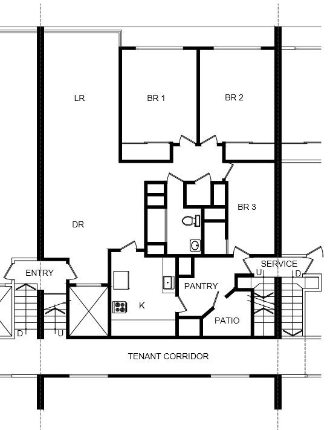
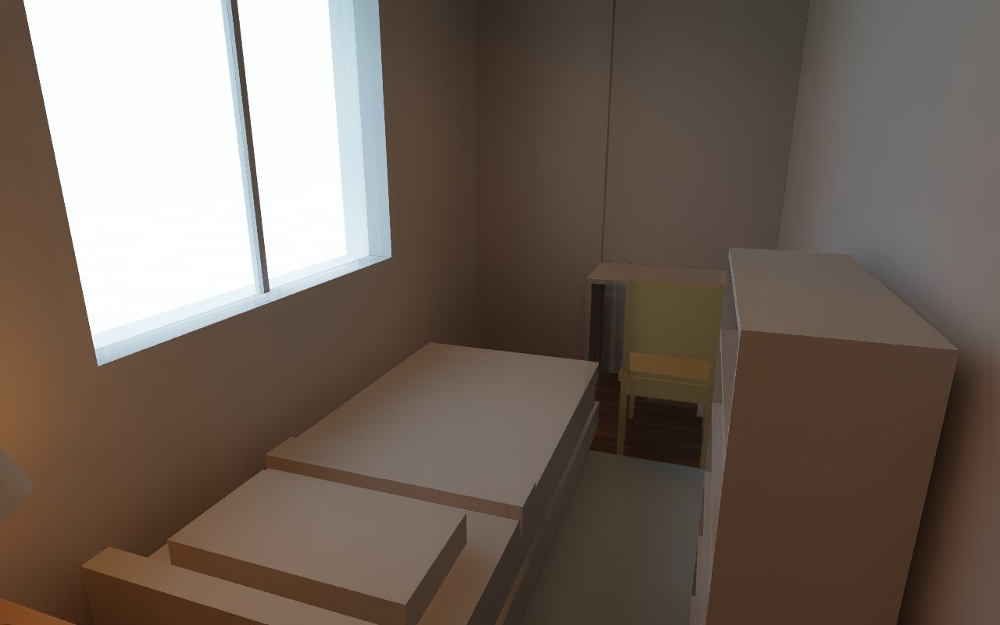

# Showcase: a real 105 m² apartment, built by an AI agent through MCP

Everything on this page was made by an AI agent talking to the editor's MCP server —
no hand-drawn geometry, no external 3D tools. The agent started from a real floor
plan, traced it at real scale, furnished and lit every room with the parametric
tools, and took the photos with the built-in path tracer.

## The reference

A real, openly licensed plan: the typical apartment of the
[FOCSA Building](https://en.wikipedia.org/wiki/FOCSA_Building) in Havana
(*Typical apartment floor plan FOCSA Building*, by Osvaldo Valdes,
[CC BY-SA 4.0](https://creativecommons.org/licenses/by-sa/4.0/), via
[Wikimedia Commons](https://commons.wikimedia.org/wiki/File:Typical_apartment_floor_plan_FOCSA_Building.jpeg)).
The drawing has no dimensions, so the scale came from things with known sizes
(doors, toilet, cooktop): **2.4 cm per pixel**, about 9.4 × 12.2 m gross.

| Reference (CC BY-SA 4.0) | Traced in 3D New Era AI |
|---|---|
|  |  |

The layout keeps the original walls, doors and windows. The program was brought up
to date: bedroom 1 became the master bedroom, bedroom 2 a home office / guest room,
bedroom 3 a kid's room, the old closet core a full bathroom and the pantry a laundry.

## Rooms

| Room | Area | Floor | Lighting (avg lx / reference) |
|---|---:|---|---|
| Living and dining (Estar e jantar) | 33.3 m² | travertine 120 × 120 | 218 / 200 |
| Master bedroom (Suíte casal) | 11.7 m² | oak planks | 172 / 150 |
| Office / guest (Escritório / hóspedes) | 11.5 m² | oak planks | 561 / 500 |
| Kid's room (Quarto infantil) | 7.1 m² | oak planks | 211 / 150 |
| Hall (Hall íntimo) | 3.4 m² | travertine | 224 / 100 |
| Bathroom (Banheiro) | 5.8 m² | grey marble 90 × 90, Nero marble walls | 383 / 200 |
| Linen closet (Rouparia) | 2.4 m² | oak planks | 254 / 150 |
| Kitchen (Cozinha) | 7.8 m² | terrazzo | 312 / 300 |
| Laundry (Lavanderia) | 5.3 m² | white tiles | 424 / 300 |
| Service patio (Pátio de serviço) | 2.5 m² | stone | 401 / 300 |

Lighting targets are the residential references of ABNT NBR ISO/CIE 8995-1; the
`lighting` tool placed every downlight and LED panel and verified the result by
photometry (inverse-square cosine law, wall shadows and interreflection).

## Photos

All photos: `render_photo`, quality `good`, 1280 × 800, sun from the compass at
15:00, or lamps at dusk.

| | |
|---|---|
|  |  |
|  |  |
|  |  |
|  |  |
|  |  |
|  | |

## How the agent built it

About 60 MCP calls. The highlights:

1. **Reference at real scale** — `set_background {path, cm_per_px: 2.4, offset}`, then
   `create {px: true, walls: [...]}` with coordinates read straight off the image
   (25 cm party walls, 12 cm partitions) and `render_plan {bg: 0.5}` to check the fit.
2. **Openings and rooms** — `place` doors with `at` + `into` (they snap into the wall
   and swing into the right room), windows, a room divider between hall and living
   room, and `create rooms` detected from the walls (`at`).
3. **Finishes** — `update` rooms with `floor_mat: "img:Travertine009.jpg 120x120"` and
   friends. The plan shows them tiled at real size.
4. **Joinery** — `joinery slats` (a 240 × 265 cm slatted wall, 46 slats computed to
   close the width) with `embed tv`; `cabinet_run` for the wardrobe and the L kitchen
   (drawers, sink under the window, cooktop, wall cabinets, blind corner); `joinery
   cove` for a plaster cove with LED strip in the living room.
5. **Furniture** — `place` with real sizes and finishes (walnut, marble, fabric), then
   `check_layout` until nothing overlaps, blocks a door or sits in a wall.
6. **Lighting** — `lighting {room, fill: "downlight" | "led-panel"}` per room: the
   lumen method gives a first count, photometry adds fixtures until the reference is met.
7. **Photos** — `cameras store {x, y, z, look_at, fov}` per room and `render_photo`.

## Textures

CC0 scans from [ambientCG](https://ambientcg.com): Travertine009, WoodFloor051,
Marble012, Marble016, Terrazzo013, Tiles107, Tiles141, Wood051, Wood092, Fabric061,
Carpet016, Plaster001 and Concrete034. Brand products (for example Portobello
porcelain tiles) can be recorded on each piece with `brand`, `model_name` and `url`
for the reference schedule, without shipping their images.

## What the showcase fixed in the app

Building a real apartment end to end surfaced a handful of issues, all fixed with tests:

- Plans now show image floor finishes tiled at their real size (PNG export, MCP
  `render_plan` and the desktop editor), with room names haloed over them.
- Photos taken from above the walls look into the rooms (ceilings used to cover them).
- `cabinet_run` no longer closes a whole counter with a filler when a sink sits beside
  a blind corner, and never plans a pull-out too narrow to build.
- Potted plants are modeled with leaves instead of a cone.
- Photos get a half-strength gray-world white balance, so daylight rooms with warm
  downlights on no longer turn orange.
- Photos render on half the cores by default (`NEWERA_RENDER_THREADS` overrides): every
  core flat out for minutes was enough to trip a desktop's power protection.
